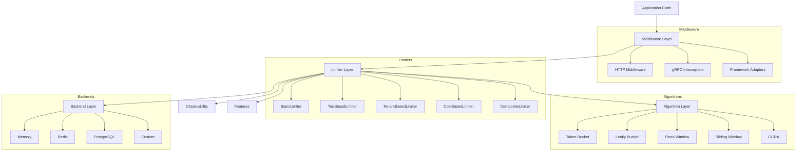
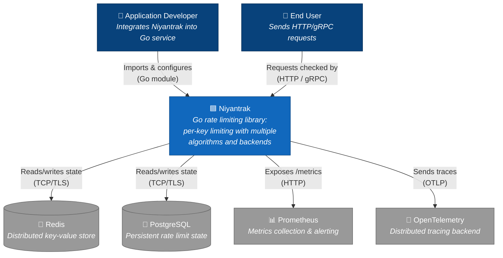
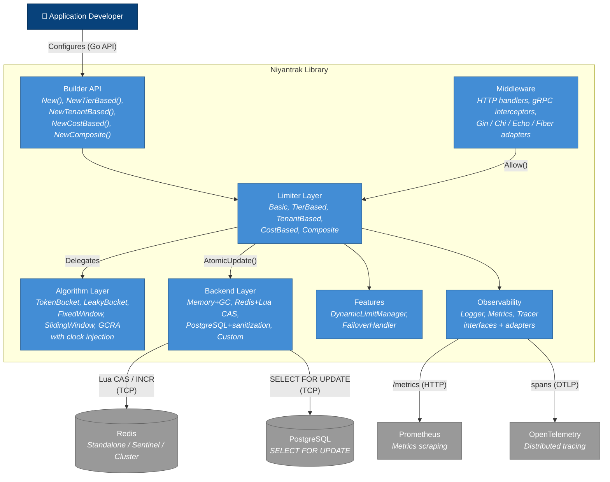
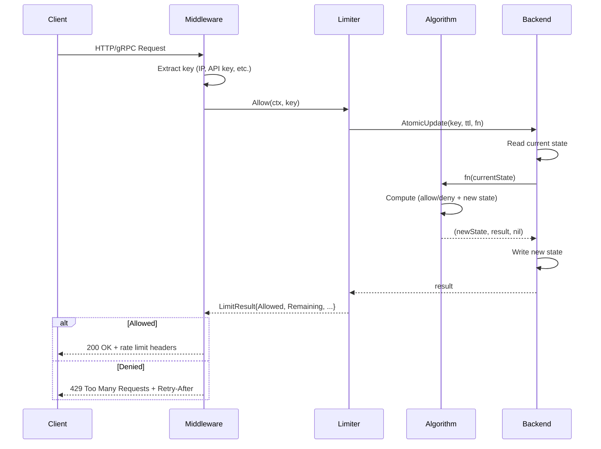
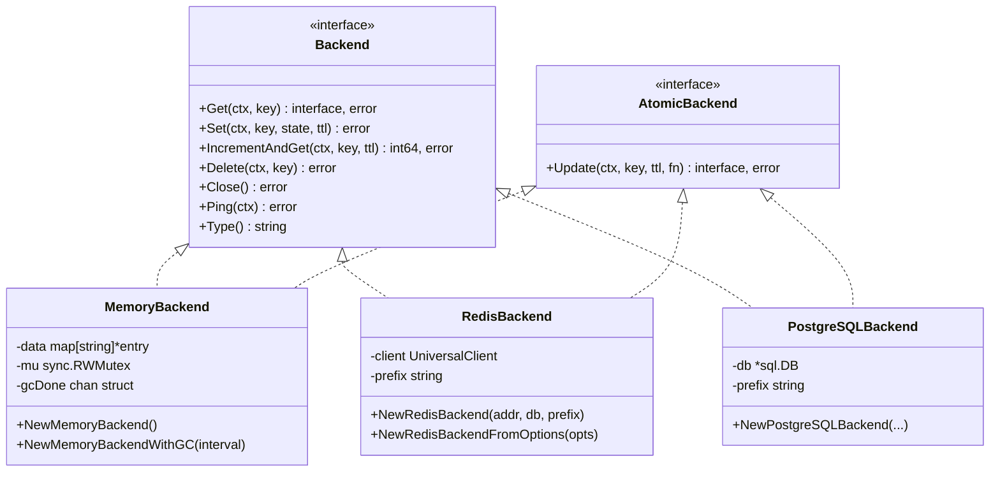
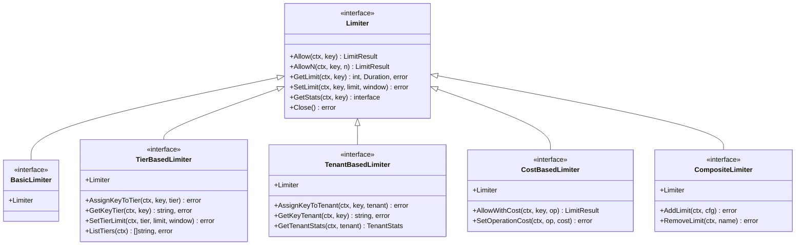
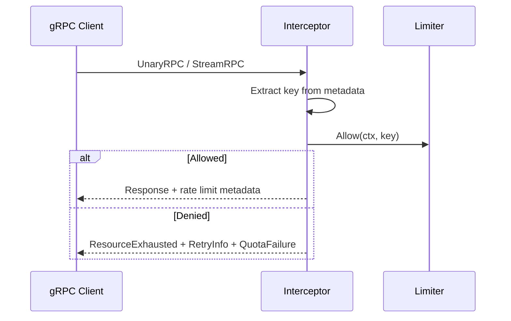
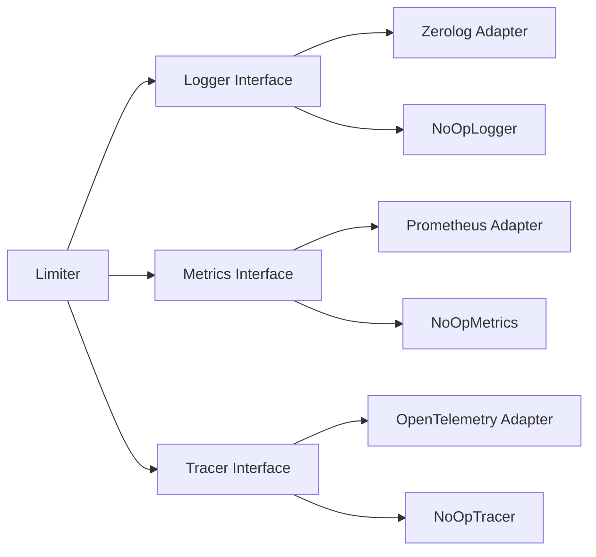

# Niyantrak — Architecture

> **नियंत्रक** (*Controller*) — A production-grade rate limiting library for Go.

---

## 1. High-Level Overview



---

## 2. C4 System Context



---

## 3. C4 Container Diagram



---

## 4. C4 Component Diagram

```mermaid
graph TD
    subgraph ALGO_PKG ["algorithm/"]
        TB["TokenBucket<br/><i>Burst + average rate</i>"]
        LB["LeakyBucket<br/><i>Smooth constant rate</i>"]
        FW["FixedWindow<br/><i>Quota per interval</i>"]
        SW["SlidingWindow<br/><i>O(1) accurate window</i>"]
        GCRA["GCRA<br/><i>Telecom-grade</i>"]
        ALGO_IF["Algorithm interface<br/><i>Allow, Reset,<br/>ValidateConfig</i>"]
        CLK["Clock interface<br/><i>Deterministic testing</i>"]
    end

    subgraph BE_PKG ["backend/"]
        BE_IF["Backend interface<br/><i>Get, Set, Delete,<br/>Ping, Close</i>"]
        ATOMIC_IF["AtomicBackend interface<br/><i>Update(key, ttl, fn)</i>"]
        ENV["Envelope<br/><i>Wrap / Unwrap<br/>typed serialization</i>"]
        MEM["memory.MemoryBackend<br/><i>sync.RWMutex + GC</i>"]
        RDS["redis.RedisBackend<br/><i>Lua CAS, UniversalClient,<br/>Cluster / Sentinel</i>"]
        PGB["postgresql.Backend<br/><i>SELECT FOR UPDATE,<br/>prefix sanitization</i>"]
        CST["custom.Backend<br/><i>User-provided</i>"]
    end

    subgraph LIM_PKG ["limiters/"]
        LIM_IF["Limiter interface<br/><i>Allow, AllowN,<br/>GetLimit, SetLimit</i>"]
        BAS["basic.BasicLimiter"]
        TIER["tier.TierBasedLimiter<br/><i>PersistMappings</i>"]
        TEN["tenant.TenantBasedLimiter<br/><i>PersistMappings</i>"]
        COST["cost.CostBasedLimiter<br/><i>AllowWithCost</i>"]
        COMP["composite.CompositeLimiter<br/><i>Multiple limits</i>"]
    end

    subgraph MW_PKG ["middleware/"]
        HTTP_MW["http.Handler<br/><i>Rate limit headers</i>"]
        GRPC_MW["grpc.Interceptors<br/><i>RetryInfo, QuotaFailure</i>"]
        GIN["adapters.Gin"]
        CHI["adapters.Chi"]
        ECHO["adapters.Echo"]
        FIBER["adapters.Fiber"]
    end

    subgraph OBS_PKG ["observability/"]
        OBS_IF["obstypes interfaces<br/><i>Logger, Metrics, Tracer</i>"]
        ZLOG["logging.Zerolog"]
        PMET["metrics.Prometheus"]
        OTRC["tracing.OpenTelemetry"]
    end

    subgraph FEAT_PKG ["features/"]
        DYN["DynamicLimitManager<br/><i>Runtime limit changes</i>"]
        FAIL["FailoverHandler<br/><i>FailOpen / FailClosed /<br/>LocalFallback</i>"]
    end

    BUILDER["builder.go<br/><i>New, NewTierBased,<br/>NewTenantBased,<br/>NewCostBased, NewComposite</i>"]

    BUILDER --> LIM_IF
    LIM_IF --> ALGO_IF
    LIM_IF --> BE_IF
    LIM_IF --> OBS_IF
    LIM_IF --> DYN
    LIM_IF --> FAIL
    MW_PKG --> LIM_IF
    BE_IF --> ENV
    RDS --> ATOMIC_IF
    MEM --> ATOMIC_IF
    PGB --> ATOMIC_IF

    style ALGO_IF fill:#438dd5,stroke:#2e6295,color:#fff
    style BE_IF fill:#438dd5,stroke:#2e6295,color:#fff
    style ATOMIC_IF fill:#438dd5,stroke:#2e6295,color:#fff
    style LIM_IF fill:#438dd5,stroke:#2e6295,color:#fff
    style OBS_IF fill:#438dd5,stroke:#2e6295,color:#fff
    style BUILDER fill:#1168bd,stroke:#0b4884,color:#fff
```



---

## 5. Request Flow



---

## 6. Algorithm Layer

All algorithms implement the `Algorithm` interface:

```go
type Algorithm interface {
    Allow(ctx context.Context, state interface{}, n int) (newState interface{}, result interface{}, err error)
    Reset(ctx context.Context) (interface{}, error)
    ValidateConfig(config interface{}) error
    GetConfig() interface{}
    Type() string
}
```

### Algorithm Comparison

| Algorithm      | Burst Support | Smoothing | Memory  | Complexity |
|---------------|:---:|:---:|:---:|:---:|
| Token Bucket   | ✅ | ❌ | O(1) | O(1) |
| Leaky Bucket   | ❌ | ✅ | O(1) | O(1) |
| Fixed Window   | ❌ | ❌ | O(1) | O(1) |
| Sliding Window | ❌ | ✅ | O(1) | O(1) |
| GCRA           | ✅ | ✅ | O(1) | O(1) |

All algorithms support **clock injection** for deterministic testing via a `Clock` interface.

---

## 7. Backend Layer

### AtomicBackend Interface

Backends optionally implement `AtomicBackend` for lock-free, race-free
read-modify-write operations:

```go
type AtomicBackend interface {
    Update(ctx context.Context, key string, ttl time.Duration,
        fn UpdateFunc) (result interface{}, err error)
}
```

The helper `backend.AtomicUpdate()` uses `AtomicBackend.Update` when available,
falling back to a non-atomic `Get→fn→Set` sequence otherwise.

### Backend Implementations



### Memory Backend — GC

`NewMemoryBackendWithGC(interval)` spawns a background goroutine that
periodically sweeps expired entries. Without GC, expired keys are only
cleaned on the next `Get()` (lazy expiry), which can cause unbounded
memory growth under write-heavy workloads.

### Redis Backend — Lua CAS

The Redis backend uses a **Lua Compare-And-Swap** script for atomic updates
instead of `WATCH/MULTI/EXEC`:

```
1. Client: GET key → oldValue
2. Client: fn(oldValue) → newValue
3. Client: EVALSHA luaCAS key oldValue newValue ttl_ms
4. Lua: if GET(key) == oldValue → SET(key, newValue, PX ttl_ms) → "OK"
         else → "CONFLICT" → retry (up to 10 times)
```

Benefits over `WATCH/MULTI`:
- **Single round-trip** for the conditional write (Lua runs server-side)
- **Works with Redis Cluster** (Lua scripts are key-local)
- **No pipeline stalls** under high contention

### Redis — Topology Support

`RedisOptions` with `UniversalClient` transparently supports:

| Topology | Config |
|----------|--------|
| Standalone | `Addrs: ["host:6379"]` |
| Sentinel | `Addrs: ["s1:26379","s2:26379"], MasterName: "mymaster"` |
| Cluster | `Addrs: ["n1:6379","n2:6379","n3:6379"]` |

Connection tuning: `DialTimeout`, `ReadTimeout`, `WriteTimeout`, `PoolSize`,
`MinIdleConns`, `MaxRetries`.

### PostgreSQL — Table Name Sanitization

The `prefix` parameter is validated against `^[a-zA-Z0-9_]*$` at construction
time to prevent SQL injection through table names.

---

## 8. Limiter Layer

### Limiter Hierarchy



### Distributed Key Mappings (Tier / Tenant)

When `PersistMappings: true` is set in `TierConfig` or `TenantConfig`,
key→tier / key→tenant assignments are stored in the backend under
`__tier_mapping:<key>` / `__tenant_mapping:<key>` prefixes. This ensures
that in a multi-instance deployment, all nodes agree on tier/tenant
assignments even without sticky sessions.

The local `keyTiers` / `keyTenants` map acts as a **read-through cache**:
miss → backend lookup → cache locally.

---

## 9. Builder API

The `niyantrak` root package provides convenience constructors:

```go
// Simple limiter
limiter, err := niyantrak.New(
    niyantrak.WithAlgorithm(niyantrak.TokenBucket),
    niyantrak.WithLimit(100),
    niyantrak.WithWindow(time.Minute),
    niyantrak.WithMemoryBackend(),
)

// Tier-based limiter
tierLimiter, err := niyantrak.NewTierBased(cfg,
    niyantrak.WithAlgorithm(niyantrak.SlidingWindow),
    niyantrak.WithBackend(redisBackend),
)

// Tenant-based, cost-based, composite
tenantLimiter, err := niyantrak.NewTenantBased(cfg, opts...)
costLimiter, err := niyantrak.NewCostBased(cfg, opts...)
compositeLimiter, err := niyantrak.NewComposite(cfg, opts...)
```

---

## 10. Middleware Layer

### HTTP Middleware

Standard `net/http` handler with rate limit headers:

```
X-RateLimit-Limit: 100
X-RateLimit-Remaining: 42
X-RateLimit-Reset: 1707350400
Retry-After: 30
```

Framework adapters for **Gin**, **Chi**, **Echo**, and **Fiber**.

### gRPC Interceptors

Unary and streaming interceptors with structured error details:



Rate-limited responses include `google.rpc.RetryInfo` and
`google.rpc.QuotaFailure` error details, enabling programmatic
retry logic in well-behaved clients.

---

## 11. Observability

All observability is **opt-in** via interfaces in the `obstypes` package.
Default implementations are **zero-cost no-ops**.



---

## 12. Features

### Dynamic Limits

Adjust rate limits at runtime based on external signals (load, time of day,
admin controls) via `DynamicLimitManager`.

### Failover

Three strategies when the primary backend is unavailable:

| Strategy | Behavior |
|----------|----------|
| `FailOpen` | Allow all requests |
| `FailClosed` | Deny all requests |
| `LocalFallback` | Switch to in-memory backend |

Health checks run periodically and automatically recover to the primary
backend when it comes back online.

---

## 13. Typed Serialization (Envelope)

JSON-backed backends (Redis, PostgreSQL) use `backend.Wrap` / `backend.Unwrap`
with type registration to preserve Go types across serialization:

```go
func init() {
    backend.RegisterType((*algorithm.TokenBucketState)(nil))
    // ... all algorithm states
}
```

The `Envelope` wraps each value with a `_type` discriminator, allowing
`Unwrap` to reconstruct the correct concrete struct.

---

## 14. Performance

Benchmark results (Apple M4, memory backend, single key):

| Benchmark | ns/op |
|-----------|------:|
| Allow (Token Bucket) | ~340 |
| Allow (Sliding Window) | ~342 |
| Allow (GCRA) | ~332 |
| AllowN (Token Bucket) | ~338 |
| Allow Parallel (Token Bucket, 10 cores) | ~477 |
| Allow Parallel Multi-Key (1000 keys) | ~504 |

All operations are **O(1)** in time and space per key.
